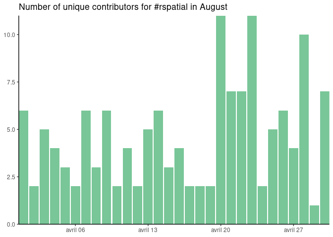

<!-- README.md is generated from README.Rmd. Please edit that file -->

# tweetrbot

<!-- badges: start -->

[](https://github.com/statnmap/tweetrbot/actions)
<!-- badges: end -->

<!-- description: start -->

This is package {tweetrbot}: Functions for a Twitter bot.  
Current version is 0.0.1 <!-- description: end -->

## Installation

<!-- install: start -->

The list of dependencies required to install this package is: {dplyr},
{knitr}, {magrittr}, {rmarkdown}, {rtweet}.

To install the package, you can run the following script

``` r
# install.packages("remotes")
remotes::install_github(repo = "statnmap/tweetrbot")
```

## Example


``` r
library(tweetrbot)
```

This package is presented in a blog post on
<https://statnmap.com/2019-08-30-create-a-twitter-bot-on-a-raspberry-pi-3-using-r>

### Run the scripts to retweet a specific hashtag

This is set for a bot. This means that every tweets retrieved from
`get_and_store()` will be retweeted using `retweet_and_update()` using a
loop, with 1 tweet every 600 seconds here. Set to `debug=TRUE` to avoid
really tweeting on Twitter if you want to make some tests.

``` r
## Retrieve tweets, store on the drive
get_and_store(query = "#rspatial", n_tweets = 20, dir = ".")
## Tweet regularly and update the table stored on the drive
retweet_and_update(dir = ".", n_tweets = 20, n_limit = 3, sys_sleep = 600, debug = TRUE)
```

    #> # A tibble: 1,568 x 92
    #>    user_id status_id created_at          screen_name text  source
    #>    <chr>   <chr>     <dttm>              <chr>       <chr> <chr> 
    #>  1 330749… 13040524… 2020-09-10 13:41:43 PennMUSA    "Hav… Twitt…
    #>  2 895591… 13040521… 2020-09-10 13:40:32 StatnMap    "🌍Th… Twitt…
    #>  3 788105… 13038515… 2020-09-10 00:23:40 taraskaduk  "Hey… Twitt…
    #>  4 828915… 13037746… 2020-09-09 19:17:55 dpprdan     "#rs… Twitt…
    #>  5 523216… 13036839… 2020-09-09 13:17:18 charliejha… "How… Twitt…
    #>  6 278275… 13036403… 2020-09-09 10:24:15 MichaelDor… "@tj… Twitt…
    #>  7 304121… 13034890… 2020-09-09 00:22:54 charles_ga… "Wha… Twitt…
    #>  8 120696… 13033874… 2020-09-08 17:39:22 ambiogeo    "Liv… Twitt…
    #>  9 121618… 13032407… 2020-09-08 07:56:26 maurosc3ner "Bay… Twitt…
    #> 10 599924… 13029931… 2020-09-07 15:32:40 ultrazool   "@ge… Twitt…
    #> # … with 1,558 more rows, and 86 more variables: display_text_width <dbl>,
    #> #   reply_to_status_id <chr>, reply_to_user_id <chr>,
    #> #   reply_to_screen_name <chr>, is_quote <lgl>, is_retweet <lgl>,
    #> #   favorite_count <int>, retweet_count <int>, quote_count <int>,
    #> #   reply_count <int>, hashtags <list>, symbols <list>, urls_url <list>,
    #> #   urls_t.co <list>, urls_expanded_url <list>, media_url <list>,
    #> #   media_t.co <list>, media_expanded_url <list>, media_type <list>,
    #> #   ext_media_url <list>, ext_media_t.co <list>, ext_media_expanded_url <list>,
    #> #   ext_media_type <chr>, mentions_user_id <list>, mentions_screen_name <list>,
    #> #   lang <chr>, quoted_status_id <chr>, quoted_text <chr>,
    #> #   quoted_created_at <dttm>, quoted_source <chr>, quoted_favorite_count <int>,
    #> #   quoted_retweet_count <int>, quoted_user_id <chr>, quoted_screen_name <chr>,
    #> #   quoted_name <chr>, quoted_followers_count <int>,
    #> #   quoted_friends_count <int>, quoted_statuses_count <int>,
    #> #   quoted_location <chr>, quoted_description <chr>, quoted_verified <lgl>,
    #> #   retweet_status_id <chr>, retweet_text <chr>, retweet_created_at <dttm>,
    #> #   retweet_source <chr>, retweet_favorite_count <int>,
    #> #   retweet_retweet_count <int>, retweet_user_id <chr>,
    #> #   retweet_screen_name <chr>, retweet_name <chr>,
    #> #   retweet_followers_count <int>, retweet_friends_count <int>,
    #> #   retweet_statuses_count <int>, retweet_location <chr>,
    #> #   retweet_description <chr>, retweet_verified <lgl>, place_url <chr>,
    #> #   place_name <chr>, place_full_name <chr>, place_type <chr>, country <chr>,
    #> #   country_code <chr>, geo_coords <list>, coords_coords <list>,
    #> #   bbox_coords <list>, status_url <chr>, name <chr>, location <chr>,
    #> #   description <chr>, url <chr>, protected <lgl>, followers_count <int>,
    #> #   friends_count <int>, listed_count <int>, statuses_count <int>,
    #> #   favourites_count <int>, account_created_at <dttm>, verified <lgl>,
    #> #   profile_url <chr>, profile_expanded_url <chr>, account_lang <lgl>,
    #> #   profile_banner_url <chr>, profile_background_url <chr>,
    #> #   profile_image_url <chr>, retweet_order <dbl>, bot_retweet <lgl>

### Run the script to retrieve your user information

``` r
get_account_info(user = "talk_rspatial")
```

### Post the most retweeted tweet of the month

Get the database gathered with `get_and_store()` and tweet the top of
the month using `top_tweets()`.

``` r
rds_file <- system.file("complete_tweets_rspatial.rds", package = "tweetrbot")
all_tweets <- readRDS(rds_file)
# filter on last month
last_month_tweets <- all_tweets %>% filter_month(the_month = 4, the_year = 2020)
# update last month
last_month_updated <- update_data(
  path = rds_file, 
  statuses = last_month_tweets$status_id)
# Get stats of last month tweets
top_tweets(all_tweets = last_month_updated, post_tweet = TRUE, top_number = 5)
```


